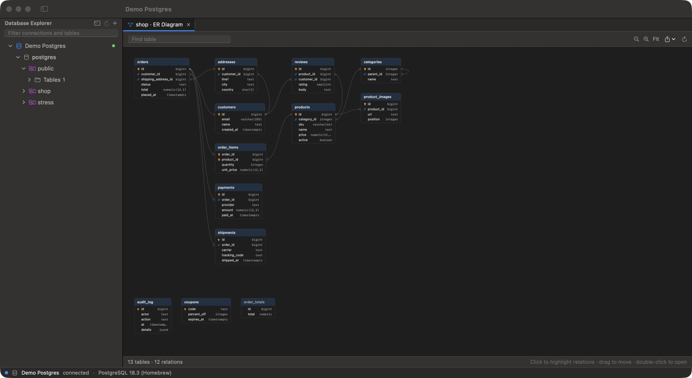

  

<h1 align="center">Quarry</h1>

  A lightweight, native macOS database client for <b>PostgreSQL</b>, <b>Redis</b> and <b>SQLite</b>. 
  A 4.8&nbsp;MB download, about 46&nbsp;MB of RAM. No Electron, no JVM.

  <a href="https://github.com/edwaldo12/quarry-releases/releases/latest"><b>Download the latest release</b></a>

---

This repository hosts Quarry's official binary releases. Quarry is free to use; its source code is not public.

## Why Quarry

Most database GUIs bundle a browser engine (Electron) or a Java runtime. Quarry is written in Swift with AppKit and SwiftUI, so it starts in a fraction of a second and stays small.

Download size and memory use of popular macOS database clients:

| App | Download | RAM after launch | Built with | Databases |
|---|---:|---:|---|---|
| **Quarry** | **4.8 MB** | **46 MB** | native (Swift) | PostgreSQL, Redis, SQLite |
| Sequel Ace | 22.1 MB | 22 MB | native | MySQL |
| Postico 2 | 11.2 MB | 47 MB | native | PostgreSQL |
| TablePlus | 134 MB | 49 MB | native | many |
| DBeaver CE | 117 MB | 290–360 MB | Java | many |
| RedisInsight | 128 MB | 449 MB | Electron | Redis |
| Beekeeper Studio | 328 MB | 690 MB | Electron | many |
| DataGrip | 970 MB | 1.1 GB | Java | many |

Quarry uses about as much memory as other native clients like Postico and TablePlus (Sequel Ace, which only does MySQL, uses less), and 6–24× less than the Java and Electron ones, while covering three databases in one app.

*How this was measured (28 September 2026, Apple silicon Mac, macOS 27):* download size from each app's official download URL. RAM is the memory footprint of all of the app's processes added together (Electron and Java apps run several), 30 seconds after launch with no connection open, two runs each. DataGrip was measured with an empty project; with a real project open and indexing it used 1.7–1.9 GB.

## Features

- **PostgreSQL.** Lists every database on the server, like DataGrip. Browse schemas, tables, views, columns, indexes, foreign keys and DDL. Rows are streamed, so a large `SELECT *` stays light. Shows NOTICEs, has a working Stop button, and a "Tx" badge while a transaction is open. TLS via the bundled OpenSSL.
- **Redis.** Key browser with SCAN, glob and type filters, and a flat or `:`-namespace tree. Type-aware editors for strings (pretty JSON), hashes, lists, sets and sorted sets. TTL editing, rename, delete, and a redis-cli-style console. AUTH/ACL, db selection, TLS.
- **SQLite.** Open any `.sqlite`, `.sqlite3`, `.db` or `.db3` file, including from Finder ("Open With → Quarry").
- **SQL console.** Syntax highlighting, autocomplete for tables, columns and aliases, errors underlined where the server reports them, one tab per result. `UPDATE`/`DELETE` without `WHERE` asks for confirmation.
- **Table data.** 500-row pages, WHERE filter, server-side sort, inline editing submitted in one transaction.
- **Results grid.** Smooth at 50,000 rows. Copy or export as CSV, TSV, JSON, Markdown or SQL `INSERT`.
- **SSH tunnels.** Reach PostgreSQL and Redis through SSH using your own keys, ssh-agent and `~/.ssh/config` aliases or jump hosts. Quarry runs the built-in `/usr/bin/ssh`, so it never sees your SSH credentials; the tunnel starts when you connect and stops when you disconnect.
- **Connect once.** Passwords are remembered in Quarry's own encrypted store, so there are no repeated macOS password prompts, even after updating Quarry.
- **ER diagram.** Right-click a schema ▸ Show ER Diagram to see its tables and foreign keys, or a table ▸ Related Tables for just its neighbours. Zoom, drag, click to highlight relations, double-click to open a table, find by name, export PNG or PDF. It loads a whole schema in three queries and lays out 500 tables in about 20 ms, and only uses memory while the tab is open.
- **Import from DataGrip.** File ▸ Import from DataGrip brings over your data sources, including passwords DataGrip saved in the macOS Keychain.
- **Color tags** for connections, query history (⌘Y) and autosaved consoles.

## Install

1. Download `Quarry-<version>-macos-arm64.zip` from [Releases](https://github.com/edwaldo12/quarry-releases/releases/latest) and unzip it.
2. Move `Quarry.app` to your Applications folder.
3. Open it. The first time, macOS blocks it because the app isn't notarized by Apple yet:
   - Open **System Settings ▸ Privacy & Security**, scroll down, and click **Open Anyway** next to the Quarry message. Then open Quarry again.
   - Or run this once in Terminal: `xattr -dr com.apple.quarantine /Applications/Quarry.app`

Each release lists the zip's SHA-256 in `SHA256SUMS.txt`. Check it with `shasum -a 256 Quarry-*.zip`.

**Requirements:** macOS 14 Sonoma or later, Apple silicon (M1 or newer). Intel Macs aren't supported.

## Keyboard shortcuts

| Shortcut | Action |
|---|---|
| ⌘N | New connection |
| ⌘O | Open SQLite file |
| ⌘T | New console for the selected database |
| ⌘W | Close tab |
| ⌘↩ | Run the statement at the caret (or the selection) |
| ⇧⌘↩ | Run the whole script |
| ⌘. | Stop the running query |
| ⌃Space | Autocomplete |
| ⌘/ | Toggle comment |
| ⌘S | Submit table edits |
| ⇧⌘E | Export results |
| ⌘R | Refresh |
| ⌘Y | Query history |
| ⌘F | Find |

## Privacy

- Connections, history and settings stay on your Mac in `~/Library/Application Support/Quarry/`.
- Passwords are stored in `secrets.vault` in the same folder: encrypted (AES-GCM) with a key tied to your Mac, and readable only by your user account. A copy won't open on another Mac. Like `~/.pgpass`, other apps running under your account could read it.
- Quarry has no telemetry, analytics or update checks. It only connects to the databases (and SSH hosts) you add.

## Limitations

- No MySQL/MariaDB, SSH password authentication (use keys or ssh-agent), Redis Cluster/Sentinel, or Redis TLS with self-signed certificates yet.
- Not notarized yet (see Install above).

## Feedback

Found a bug or want a feature? [Open an issue](https://github.com/edwaldo12/quarry-releases/issues).

## License

Quarry is free to use. Copyright © 2026 Edwaldo Utama. Quarry includes libpq (PostgreSQL License) and OpenSSL (Apache License 2.0); see [THIRD_PARTY_NOTICES.txt](THIRD_PARTY_NOTICES.txt).
