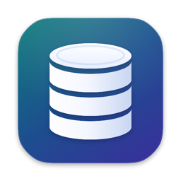
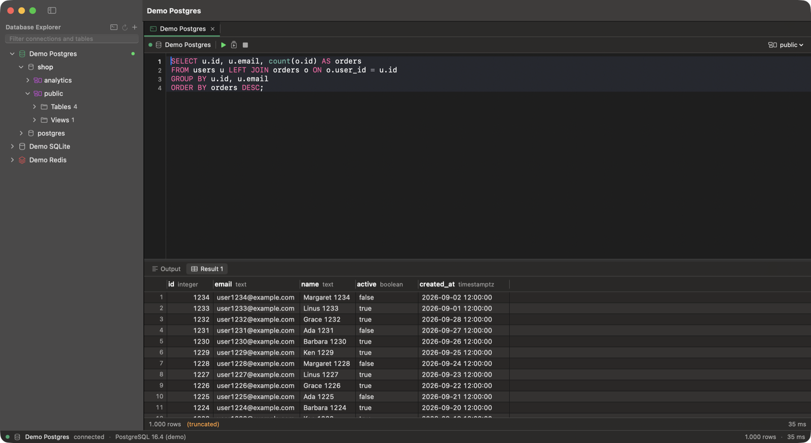
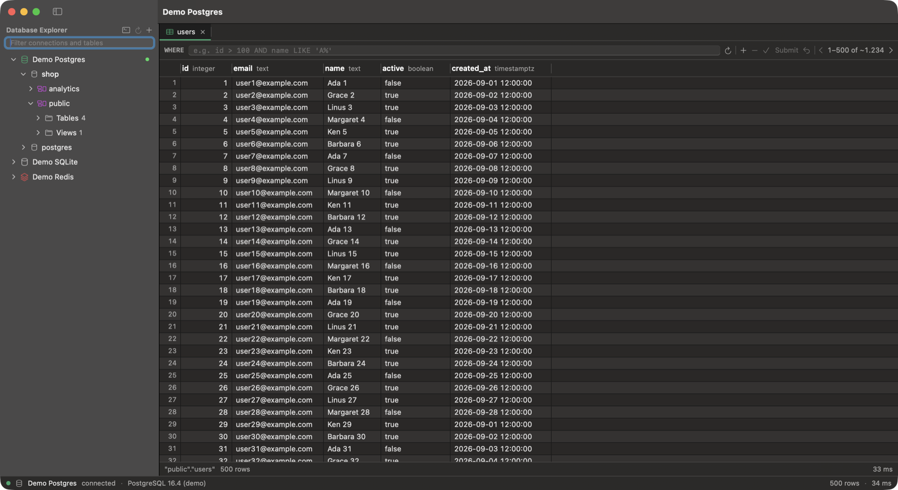
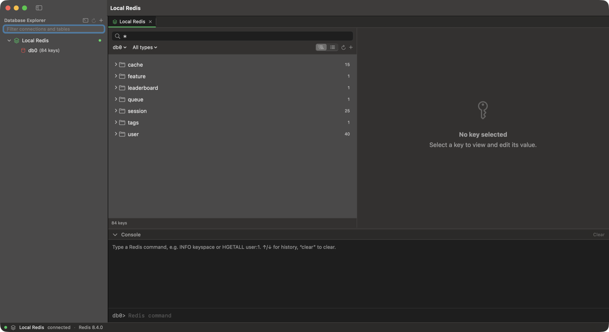

  

<h1 align="center">Quarry</h1>

  A lightweight, native macOS database client for <b>PostgreSQL</b>, <b>Redis</b> and <b>SQLite</b>. 
  A 4.7&nbsp;MB download. No Electron, no JVM.

  <a href="https://github.com/edwaldo12/quarry-releases/releases/latest"><b>Download the latest release</b></a>

---

This repository hosts Quarry's official binary releases. Quarry is free to use; its source code is not public.

## Why Quarry

Most database GUIs bundle a browser engine (Electron) or a Java runtime. Quarry is written in Swift with AppKit and SwiftUI, so it starts in a fraction of a second and stays small.

Download sizes of popular macOS database clients, measured on 27 September 2026 from each app's official download URL:

| App | Download | Databases |
|---|---:|---|
| **Quarry** | **4.7 MB** | PostgreSQL, Redis, SQLite |
| Postico 2 | 11.2 MB | PostgreSQL |
| Sequel Ace | 22.1 MB | MySQL |
| DBeaver CE | 117 MB | many |
| RedisInsight | 128 MB | Redis |
| TablePlus | 134 MB | many |
| Beekeeper Studio | 328 MB | many |
| DataGrip | 970 MB | many |

## Features

- **PostgreSQL.** Lists every database on the server, like DataGrip. Browse schemas, tables, views, columns, indexes, foreign keys and DDL. Rows are streamed, so a large `SELECT *` stays light. Shows NOTICEs, has a working Stop button, and a "Tx" badge while a transaction is open. TLS via the bundled OpenSSL.
- **Redis.** Key browser with SCAN, glob and type filters, and a flat or `:`-namespace tree. Type-aware editors for strings (pretty JSON), hashes, lists, sets and sorted sets. TTL editing, rename, delete, and a redis-cli-style console. AUTH/ACL, db selection, TLS.
- **SQLite.** Open any `.sqlite`, `.sqlite3`, `.db` or `.db3` file, including from Finder ("Open With → Quarry").
- **SQL console.** Syntax highlighting, autocomplete for tables, columns and aliases, errors underlined where the server reports them, one tab per result. `UPDATE`/`DELETE` without `WHERE` asks for confirmation.
- **Table data.** 500-row pages, WHERE filter, server-side sort, inline editing submitted in one transaction.
- **Results grid.** Smooth at 50,000 rows. Copy or export as CSV, TSV, JSON, Markdown or SQL `INSERT`.
- **Import from DataGrip.** File ▸ Import from DataGrip brings over your data sources, including passwords saved in the macOS Keychain.
- **Color tags** for connections, query history (⌘Y) and autosaved consoles.

## Install

1. Download `Quarry-<version>-macos-arm64.zip` from [Releases](https://github.com/edwaldo12/quarry-releases/releases/latest) and unzip it.
2. Move `Quarry.app` to your Applications folder.
3. Open it. The first time, macOS blocks it because the app isn't notarized by Apple yet:
   - Open **System Settings ▸ Privacy & Security**, scroll down, and click **Open Anyway** next to the Quarry message. Then open Quarry again.
   - Or run this once in Terminal: `xattr -dr com.apple.quarantine /Applications/Quarry.app`

Each release lists the zip's SHA-256 in `SHA256SUMS.txt`. Check it with `shasum -a 256 Quarry-*.zip`.

**Requirements:** macOS 14 Sonoma or later, Apple silicon (M1 or newer). Intel Macs aren't supported.

## Keyboard shortcuts

| Shortcut | Action |
|---|---|
| ⌘N | New connection |
| ⌘O | Open SQLite file |
| ⌘T | New console for the selected database |
| ⌘W | Close tab |
| ⌘↩ | Run the statement at the caret (or the selection) |
| ⇧⌘↩ | Run the whole script |
| ⌘. | Stop the running query |
| ⌃Space | Autocomplete |
| ⌘/ | Toggle comment |
| ⌘S | Submit table edits |
| ⇧⌘E | Export results |
| ⌘R | Refresh |
| ⌘Y | Query history |
| ⌘F | Find |

## Privacy

- Connections, history and settings stay on your Mac in `~/Library/Application Support/Quarry/`.
- Passwords are stored in the macOS Keychain, never on disk.
- Quarry has no telemetry, analytics or update checks. It only connects to the databases you add.

## Limitations

- No MySQL/MariaDB, SSH tunnels, Redis Cluster/Sentinel, or Redis TLS with self-signed certificates yet.
- Not notarized yet (see Install above).

## Feedback

Found a bug or want a feature? [Open an issue](https://github.com/edwaldo12/quarry-releases/issues).

## License

Quarry is free to use. Copyright © 2026 Edwaldo Utama. Quarry includes libpq (PostgreSQL License) and OpenSSL (Apache License 2.0); see [THIRD_PARTY_NOTICES.txt](THIRD_PARTY_NOTICES.txt).
